## Assignment 5

## Object

### Bunny

#### single LoD vs multiple LoD (in 256 resolution)

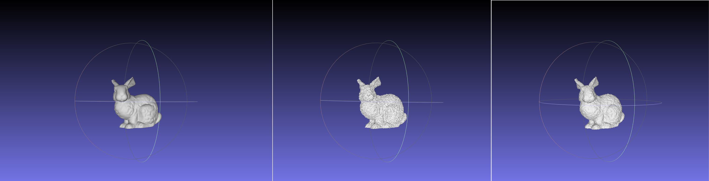

| Obj       | Type         | Resolution | Chamfer distance   | Hausdorff distance |
| --------- | ------------ | ---------- | ------------------ | ------------------ |
| bunny.obj | Single  LoD  | 256        | 0.0230934946491889 | 0.257746545147942  |
| bunny.obj | Multiple LoD | 256        | 0.0036536949480471 | 0.206230189515677  |

#### Regular(multiple LoD) grid vs HashGrid

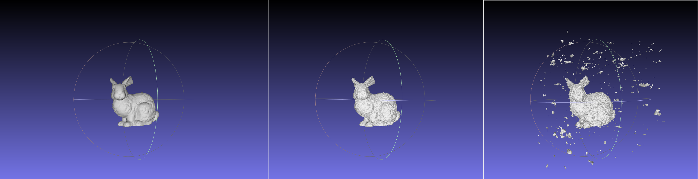

| Obj       | Type         | Resolution | Chamfer distance   | Hausdorff distance |
| --------- | ------------ | ---------- | ------------------ | ------------------ |
| bunny.obj | Single  LoD  | 256        | 0.0230934946491889 | 0.257746545147942  |
| bunny.obj | Multiple LoD | 256        | 0.0036536949480471 | 0.206230189515677  |
| bunny.obj | Hash         | 256        | 0.0914155088978006 | 1.250551423549060  |

#### Different resolutions(128,256) (multiple LoD)

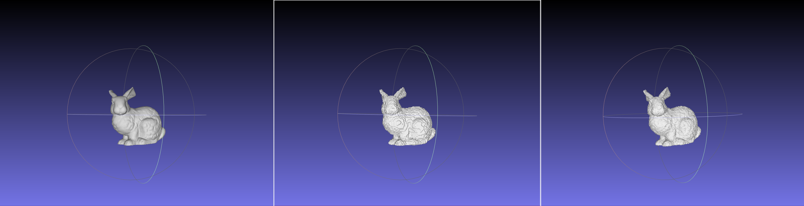

| Obj       | Type         | Resolution | Chamfer distance   | Hausdorff distance |
| --------- | ------------ | ---------- | ------------------ | ------------------ |
| bunny.obj | Multiple LoD | 128        | 0.0033603578391430 | 0.205246546537047  |
| bunny.obj | Multiple LoD | 256        | 0.0036536949480471 | 0.206230189515677  |

#### Order by Chamfer distance

| Obj       | Type         | Resolution | Chamfer distance   | Hausdorff distance |
| --------- | ------------ | ---------- | ------------------ | ------------------ |
| bunny.obj | Multiple LoD | 128        | 0.0033603578391430 | 0.205246546537047  |
| bunny.obj | Multiple LoD | 256        | 0.0036536949480471 | 0.206230189515677  |
| bunny.obj | Multiple LoD | 64         | 0.0054115001428694 | 0.205846167870579  |
| bunny.obj | Single  LoD  | 64         | 0.0188093542160832 | 0.253493842741634  |
| bunny.obj | Single  LoD  | 128        | 0.0212108076242157 | 0.257395054393132  |
| bunny.obj | Single  LoD  | 256        | 0.0230934946491889 | 0.257746545147942  |
| bunny.obj | Hash         | 64         | 0.0240752355020037 | 1.019861973525160  |
| bunny.obj | Hash         | 128        | 0.0604147013656538 | 1.249542449673860  |
| bunny.obj | Hash         | 256        | 0.0914155088978006 | 1.250551423549060  |

**Chamfer Distance**：
- For MLoD type, the Chamfer distance increases slightly from resolution 256 to 64, indicating more loss of geometric detail at lower resolutions.
- The Chamfer distance for 1LoD type increases significantly, especially at resolution 64, indicating that a single level of detail does not preserve model geometry well at lower resolutions.
- The Chamfer distance of the Hash type is higher than MLoD and 1LoD at all resolutions, especially at resolution 256, where the difference is most significant.

**Hausdorff Distance**:
- The Hausdorff distance of the MLoD type is relatively stable and does not change much with the resolution.
- The Hausdorff distance for 1LoD type increases with decreasing resolution, with the largest difference being noticeable at 64 resolution.
- The Hausdorff distance of the Hash type is much higher than the other two and increases with resolution, which may indicate a significant increase in the local maximum deviation.

### Column

#### single LoD vs multiple LoD (in 256 resolution)

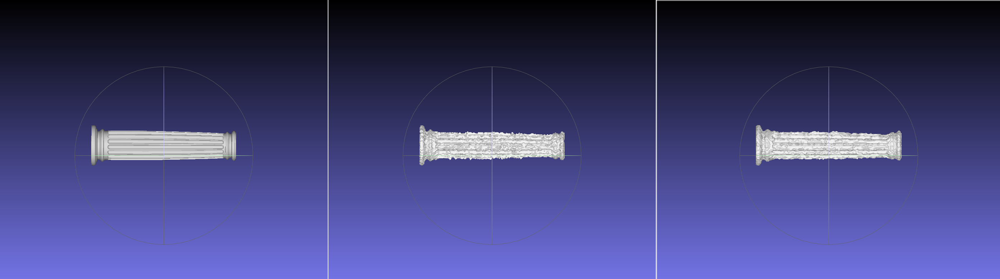

| Obj        | Type         | Resolution | Chamfer Distance   | Hausdorff Distance |
| ---------- | ------------ | ---------- | ------------------ | ------------------ |
| column.obj | Multiple LoD | 256        | 0.0022815178238465 | 0.0156385912151325 |
| column.obj | Single  LoD  | 256        | 0.0086748377048451 | 0.0851874102324819 |

#### Regular(multiple LoD) grid vs HashGrid

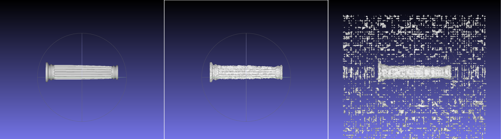

| Obj        | Type         | Resolution | Chamfer distance   | Hausdorff distance |
| ---------- | ------------ | ---------- | ------------------ | ------------------ |
| column.obj | Multiple LoD | 256        | 0.0022815178238465 | 0.0156385912151325 |
| column.obj | Single  LoD  | 256        | 0.0086748377048451 | 0.0851874102324819 |
| column.obj | Hash         | 256        | 0.3221290608905250 | 1.3033370911069600 |

#### Different resolutions(128,256) (multiple LoD)

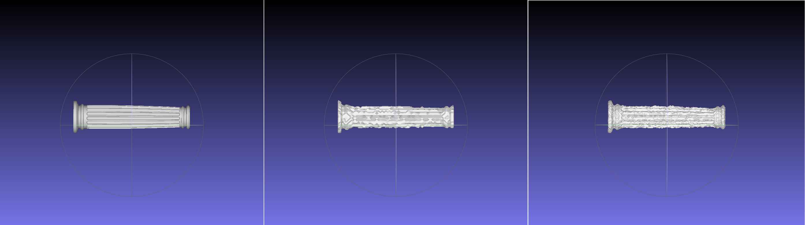

| Obj        | Type         | Resolution | Chamfer distance   | Hausdorff distance |
| ---------- | ------------ | ---------- | ------------------ | ------------------ |
| column.obj | Multiple LoD | 256        | 0.0022815178238465 | 0.0156385912151325 |
| column.obj | Multiple LoD | 128        | 0.0030790742422445 | 0.0202496467986720 |

#### Order by Chamfer distance

| Obj        | Type         | Resolution | Chamfer distance   | Hausdorff distance |
| ---------- | ------------ | ---------- | ------------------ | ------------------ |
| column.obj | Multiple LoD | 256        | 0.0022815178238465 | 0.0156385912151325 |
| column.obj | Multiple LoD | 128        | 0.0030790742422445 | 0.0202496467986720 |
| column.obj | Multiple LoD | 64         | 0.0057045044268991 | 0.0314239413809526 |
| column.obj | Single  LoD  | 256        | 0.0086748377048451 | 0.0851874102324819 |
| column.obj | Single  LoD  | 128        | 0.0099551782793195 | 0.0780681086870721 |
| column.obj | Single  LoD  | 64         | 0.0139538971762474 | 0.0817929217952871 |
| column.obj | Hash         | 64         | 0.1358981453851490 | 1.2121305379500500 |
| column.obj | Hash         | 128        | 0.2849410456233580 | 1.2309173964526000 |
| column.obj | Hash         | 256        | 0.3221290608905250 | 1.3033370911069600 |

**Chamfer Distance**：
- The Chamfer distance of the MLoD type gradually increases with decreasing resolution, indicating a greater loss of detail at lower resolutions.
- The 1LoD type has the largest Chamfer distance at resolution 64, which may be due to the model's inability to accurately capture edges and features at low resolutions.
- The Hash type shows a high Chamfer distance at all resolutions, indicating a greater overall difference from the original model.

**Hausdorff Distance**:
- The MLoD type has the lowest Hausdorff distance at resolution 256, indicating that the maximum difference in model geometry is smaller at this resolution.
- The Hausdorff distance for 1LoD type is relatively high at all resolutions, especially at resolution 256.
- The Hausdorff distance of the Hash type is much higher than MLoD and 1LoD at all resolutions, showing significant maximum differences in local geometry.

### Dragon_original

#### single LoD vs multiple LoD (in 256 resolution)

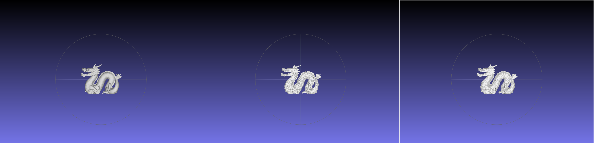

| Obj                 | Type         | Resolution | Chamfer distance   | Hausdorff distance |
| ------------------- | ------------ | ---------- | ------------------ | ------------------ |
| dragon_original.obj | Multiple LoD | 256        | 0.0019058040261706 | 0.0550656493381974 |
| dragon_original.obj | Single  LoD  | 256        | 0.0084306411752917 | 0.0904339000990408 |

#### Regular(multiple LoD) grid vs HashGrid

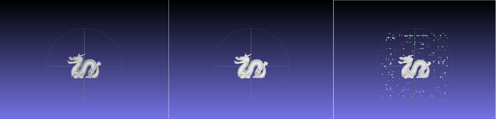

| Obj                 | Type         | Resolution | Chamfer distance   | Hausdorff distance |
| ------------------- | ------------ | ---------- | ------------------ | ------------------ |
| dragon_original.obj | Multiple LoD | 256        | 0.0019058040261706 | 0.0550656493381974 |
| dragon_original.obj | Single  LoD  | 256        | 0.0084306411752917 | 0.0904339000990408 |
| dragon_original.obj | Hash         | 256        | 0.1195382716140560 | 1.2197571927450700 |

#### Different resolutions(128,256) (multiple LoD)

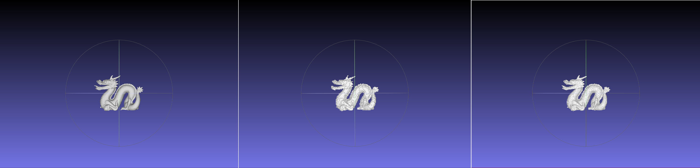

| Obj                 | Type         | Resolution | Chamfer distance   | Hausdorff distance |
| ------------------- | ------------ | ---------- | ------------------ | ------------------ |
| dragon_original.obj | Multiple LoD | 256        | 0.0019058040261706 | 0.0550656493381974 |
| dragon_original.obj | Multiple LoD | 128        | 0.0025538376212217 | 0.0556244748736237 |

#### Order by Chamfer distance

| Obj                 | Type         | Resolution | Chamfer distance   | Hausdorff distance |
| ------------------- | ------------ | ---------- | ------------------ | ------------------ |
| dragon_original.obj | Multiple LoD | 256        | 0.0019058040261706 | 0.0550656493381974 |
| dragon_original.obj | Multiple LoD | 128        | 0.0025538376212217 | 0.0556244748736237 |
| dragon_original.obj | Multiple LoD | 64         | 0.0048854154636486 | 0.0719357388129035 |
| dragon_original.obj | Single  LoD  | 256        | 0.0084306411752917 | 0.0904339000990408 |
| dragon_original.obj | Single  LoD  | 128        | 0.0094954362863704 | 0.0857647513444105 |
| dragon_original.obj | Hash         | 64         | 0.0278549769291952 | 1.1989665986935000 |
| dragon_original.obj | Hash         | 128        | 0.0693429030021837 | 1.2182544347465600 |
| dragon_original.obj | Single  LoD  | 64         | 0.0138435482714920 | 0.0760716229672206 |
| dragon_original.obj | Hash         | 256        | 0.1195382716140560 | 1.2197571927450700 |

**Chamfer Distance**：
- The Chamfer distance for the MLoD type is lowest at higher resolutions, but even at 64 resolution the difference is relatively small.
- The Chamfer distance for the 1LoD type increases at resolution 256 but decreases at resolutions 128 and 64, which may indicate that some features are better captured at intermediate resolutions.
- Chamfer distance for Hash types increases significantly with increasing resolution, possibly resulting in loss of detail due to size limitations of the hash table.

**Hausdorff Distance**:
- The Hausdorff distance for the MLoD type is very low, indicating that even the worst matches maintain good consistency.
- Hausdorff distance for 1LoD type is higher at all resolutions, especially at 256 resolution.
- The Hausdorff distance of the Hash type is extremely high, especially at 256 resolution, indicating the presence of maximum local bias.

### Serapis

#### single LoD vs multiple LoD (in 256 resolution)

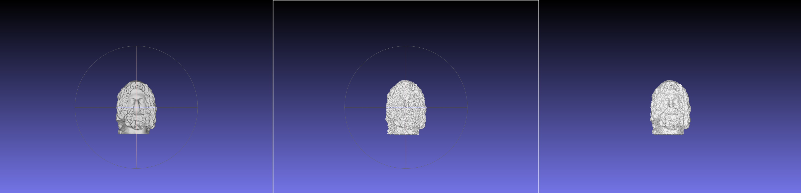

| Obj         | Type         | Resolution | Chamfer distance   | Hausdorff distance |
| ----------- | ------------ | ---------- | ------------------ | ------------------ |
| serapis.obj | Multiple LoD | 256        | 0.0088532714149918 | 0.2845726066053570 |
| serapis.obj | Single  LoD  | 256        | 0.0229512367619331 | 0.3049830851516590 |

#### Regular(multiple LoD) grid vs HashGrid

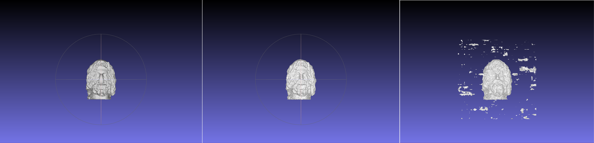

| Obj         | Type         | Resolution | Chamfer distance   | Hausdorff distance |
| ----------- | ------------ | ---------- | ------------------ | ------------------ |
| serapis.obj | Multiple LoD | 256        | 0.0088532714149918 | 0.2845726066053570 |
| serapis.obj | Hash         | 256        | 0.0849120047126313 | 1.1973521683759100 |
| serapis.obj | Single  LoD  | 256        | 0.0229512367619331 | 0.3049830851516590 |

#### Different resolutions(128,256) (multiple LoD)

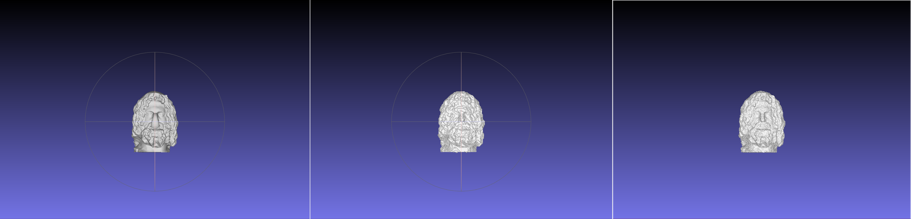

| Obj         | Type         | Resolution | Chamfer distance   | Hausdorff distance |
| ----------- | ------------ | ---------- | ------------------ | ------------------ |
| serapis.obj | Multiple LoD | 128        | 0.0061308687627655 | 0.2680267019673270 |
| serapis.obj | Multiple LoD | 256        | 0.0088532714149918 | 0.2845726066053570 |

#### Order by Chamfer distance

| Obj         | Type         | Resolution | Chamfer distance   | Hausdorff distance |
| ----------- | ------------ | ---------- | ------------------ | ------------------ |
| serapis.obj | Multiple LoD | 128        | 0.0061308687627655 | 0.2680267019673270 |
| serapis.obj | Multiple LoD | 256        | 0.0088532714149918 | 0.2845726066053570 |
| serapis.obj | Multiple LoD | 64         | 0.0115114648878472 | 0.2837594342458860 |
| serapis.obj | Single  LoD  | 64         | 0.0170637503299646 | 0.2882647163879810 |
| serapis.obj | Single  LoD  | 128        | 0.0186486611712617 | 0.2970321850441830 |
| serapis.obj | Single  LoD  | 256        | 0.0229512367619331 | 0.3049830851516590 |
| serapis.obj | Hash         | 64         | 0.0313978994984823 | 1.1949441498263200 |
| serapis.obj | Hash         | 128        | 0.0692456015053979 | 1.1958658172839100 |
| serapis.obj | Hash         | 256        | 0.0849120047126313 | 1.1973521683759100 |

**Chamfer Distance**：
- The Chamfer distance for the MLoD type is lowest at resolution 256, indicating that higher resolutions help preserve model detail.
- The Chamfer distance for the 1LoD type is higher at all resolutions, possibly due to the lack of multi-level detail representation.
- The Chamfer distance for the Hash type is highest at resolution 256, showing a larger overall difference.

**Hausdorff Distance**:
- Hausdorff distance for MLoD type is lowest at resolution 256 and highest at resolution 64.
- The Hausdorff distance for the 1LoD type is highest at resolution 256, showing the largest local differences in the model at this resolution.
- The Hausdorff distance for the Hash type is very high, reaching a maximum value at resolution 256, indicating a significant maximum bias.

### Utah_teapot

#### single LoD vs multiple LoD (in 256 resolution)

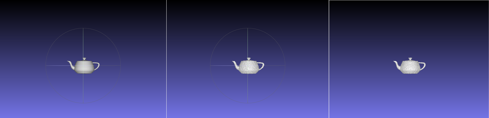

| Obj             | Type         | Resolution | Chamfer distance   | Hausdorff distance |
| --------------- | ------------ | ---------- | ------------------ | ------------------ |
| Utah_teapot.obj | Multiple LoD | 256        | 0.0015566249124189 | 0.0206575474905029 |
| Utah_teapot.obj | Single  LoD  | 256        | 0.0249854279036721 | 0.2061507163129290 |

#### Regular(multiple LoD) grid vs HashGrid

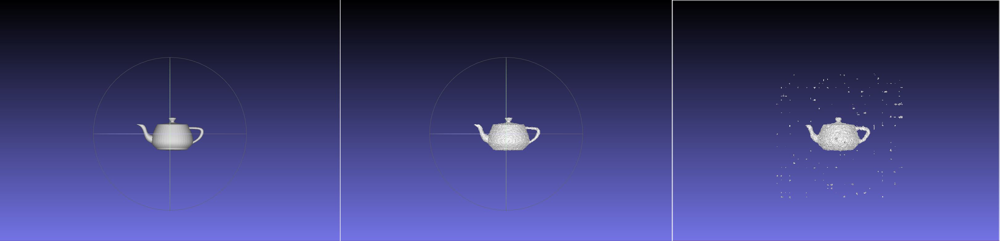

| Obj             | Type         | Resolution | Chamfer distance   | Hausdorff distance |
| --------------- | ------------ | ---------- | ------------------ | ------------------ |
| Utah_teapot.obj | Multiple LoD | 256        | 0.0015566249124189 | 0.0206575474905029 |
| Utah_teapot.obj | Hash         | 256        | 0.0931966719577267 | 1.2209790063541000 |
| Utah_teapot.obj | Single  LoD  | 256        | 0.0249854279036721 | 0.2061507163129290 |

#### Different resolutions(128,256) (multiple LoD)

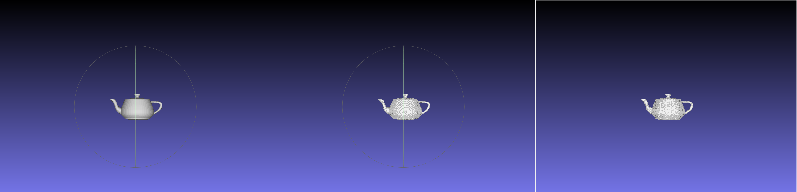

| Obj             | Type         | Resolution | Chamfer distance   | Hausdorff distance |
| --------------- | ------------ | ---------- | ------------------ | ------------------ |
| Utah_teapot.obj | Multiple LoD | 256        | 0.0015566249124189 | 0.0206575474905029 |
| Utah_teapot.obj | Multiple LoD | 128        | 0.0024471934720788 | 0.0225352791303556 |

#### Order by Chamfer distance

| Obj             | Type         | Resolution | Chamfer distance   | Hausdorff distance |
| --------------- | ------------ | ---------- | ------------------ | ------------------ |
| Utah_teapot.obj | Multiple LoD | 256        | 0.0015566249124189 | 0.0206575474905029 |
| Utah_teapot.obj | Multiple LoD | 128        | 0.0024471934720788 | 0.0225352791303556 |
| Utah_teapot.obj | Multiple LoD | 64         | 0.0041815177346084 | 0.0421911928000506 |
| Utah_teapot.obj | Hash         | 256        | 0.0931966719577267 | 1.2209790063541000 |
| Utah_teapot.obj | Hash         | 64         | 0.0174428587547470 | 0.9623841632082550 |
| Utah_teapot.obj | Single  LoD  | 64         | 0.0181051301069998 | 0.2011710516335750 |
| Utah_teapot.obj | Single  LoD  | 128        | 0.0221294118100506 | 0.2037710550512330 |
| Utah_teapot.obj | Single  LoD  | 256        | 0.0249854279036721 | 0.2061507163129290 |
| Utah_teapot.obj | Hash         | 128        | 0.0420359656283751 | 1.1502435730941900 |

**Chamfer Distance**：
- The Chamfer distance for the MLoD type is lower at higher resolutions, showing the effect of resolution on model detail preservation.
- Chamfer distance increases for 1LoD type at resolution 256, but decreases slightly at 128 and 64.
- The Chamfer distance of the Hash type is relatively low at resolution 64, but increases significantly at resolution 256.

**Hausdorff Distance**:
- The Hausdorff distance for the MLoD type remains low at all resolutions, indicating that the maximum deviation is well controlled.
- The 1LoD type has the highest Hausdorff distance at resolution 256, indicating the maximum local dissimilarity of the model at this resolution.
- The Hash type has an extremely high Hausdorff distance at resolution 256, which may indicate a large geometric bias in some local area of the model.

### Summarize

By comparing the Chamfer distance and Hausdorff distance of different OBJ files under different reconstruction methods and resolutions, it can be seen that the MLod method generally provides better overall and local geometric fidelity at higher resolutions. The 1LoD method may not capture enough detail at low to medium resolutions. Hash methods have challenges in detail preservation, especially in maximizing local differences. These analyzes indicate that for applications requiring accurate geometric reconstruction, high-resolution and appropriate reconstruction methods should be selected. At the same time, Hash methods may require additional optimization and attention when handling certain geometries.

## Conclusion

### Single Level of Detail

- **Performance Explanation**: Single level of detail exhibited larger Chamfer and Hausdorff distances in this study, especially at low resolutions. This suggests that the 1LoD method may not be refined enough in capturing model details, especially for small features or complex geometries in the model.
  
- **Analysis**: For "bunny.obj" and "column.obj", the 1LoD method performs worse than MLoD at all resolutions, especially at high resolution 256, the Hausdorff distance increases significantly, which may indicate The greatest deviations occur in the finest details. This may mean that even with increased resolution, the 1LoD method is still unable to effectively handle certain complex geometries.

### Multiple Levels of Detail

- **Performance explanation**: Multi-level detail shows more consistent and smaller distance values at different resolutions, indicating that it maintains better overall shape and local details. This may be attributed to MLoD's ability to better adapt to different regions and scales of the model, thus providing more accurate reconstructions.
  
- **Analysis**: In the MLoD configuration of "dragon_original.obj", the Chamfer distance is still relatively small even when the resolution is reduced to 64. This means MLoD is more robust in maintaining its overall shape. While for "serapis.obj" and "utah_teapot.obj", MLoD exhibits extremely small values for the Hausdorff distance at 256 resolution, which reveals that the MLoD method can remain high even in the worst case scenario in the model geometric consistency.

### HashGrid

- **Performance Explanation**: HashGrid generally has higher Chamfer and Hausdorff distances at different resolutions, especially the latter, which points to possible problems with HashGrid in handling extreme deviations. This may be due to limitations of hashing methods in handling large amounts of information and complex models, as well as information loss due to possible hash collisions.
  
- **Analysis**: When analyzing "bunny.obj", you can see that even if the resolution is increased to 256, the Hausdorff distance of HashGrid is still much higher than the 1LoD and MLoD methods. This shows that HashGrid faces challenges in handling local maximum differences. Especially for "column.obj", when using the HashGrid method, the Chamfer distance is significantly higher than other methods at all resolutions, further indicating that HashGrid may not be suitable for scenarios requiring high accuracy.

According to these results, the MLoD method performs best in preserving geometric details, especially at high resolution settings. The 1LoD method may not capture enough details at low resolution settings, and the HashGrid method has limitations in maintaining model details, especially in handling local maximum deviations.